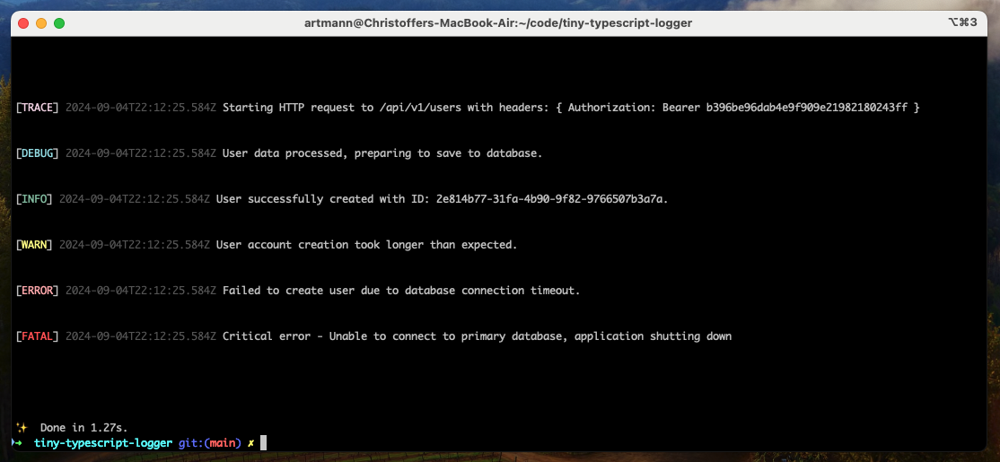

<h1>Tiny TypeScript Logger</h2>

<p>
  <a href="https://github.com/artmann/tiny-typescript-logger/actions?query=workflow%3AProd+branch%3Amain">
    
  </a>

  <a href="https://codecov.io/gh/artmann/tiny-typescript-logger">
    
  </a>

  <a href="https://twitter.com/acdlite/status/974390255393505280">
    
  </a>

  <a href="https://www.npmjs.com/package/tiny-typescript-logger">
    
  </a>

  <a href="https://www.npmjs.com/package/tiny-typescript-logger">
    
  </a>

  <a href="#badge">
    
  </a>

</p>



Get wonderful colorized log messages straight into your terminal.

## Getting Started

Install it using your favorite package manager:

```sh
npm install tiny-typescript-logger
yarn install tiny-typescript-logger
pnpm install tiny-typescript-logger

```

Log anything your dream desires:

```ts
import { log } from 'tiny-typescript-logger'

log.info('Order processed successfully.')
log.error('Failed to process order with orderId=12345.')
```

## Log Levels

This library has six built-in log levels, listed in the lowest to highest
severity range.

- Trace (`10`)
- Debug (`20`)
- Info (`30`)
- Warn (`40`)
- Error (`50`)
- Fatal (`60`)

## Contributing

Contributions are welcome! If you have suggestions or want to contribute new
features, open a pull request or file an issue.

1. Fork the repository.
2. Create a feature branch (`git checkout -b feature/new-feature`).
3. Commit your changes (`git commit -m 'Add new feature'`).
4. Push to the branch (`git push origin feature/new-feature`).
5. Open a pull request.

## License

This project is licensed under the MIT License. See the [LICENSE](LICENSE) file
for more details.
